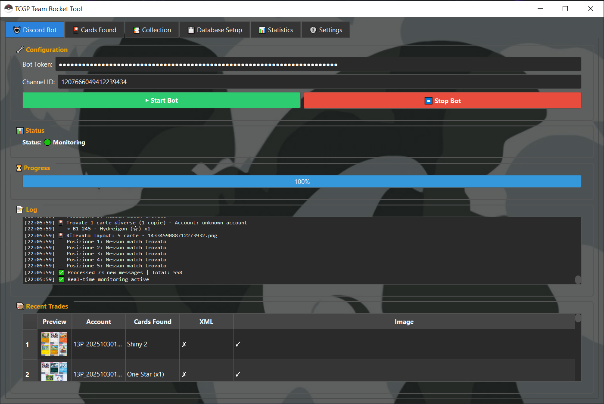
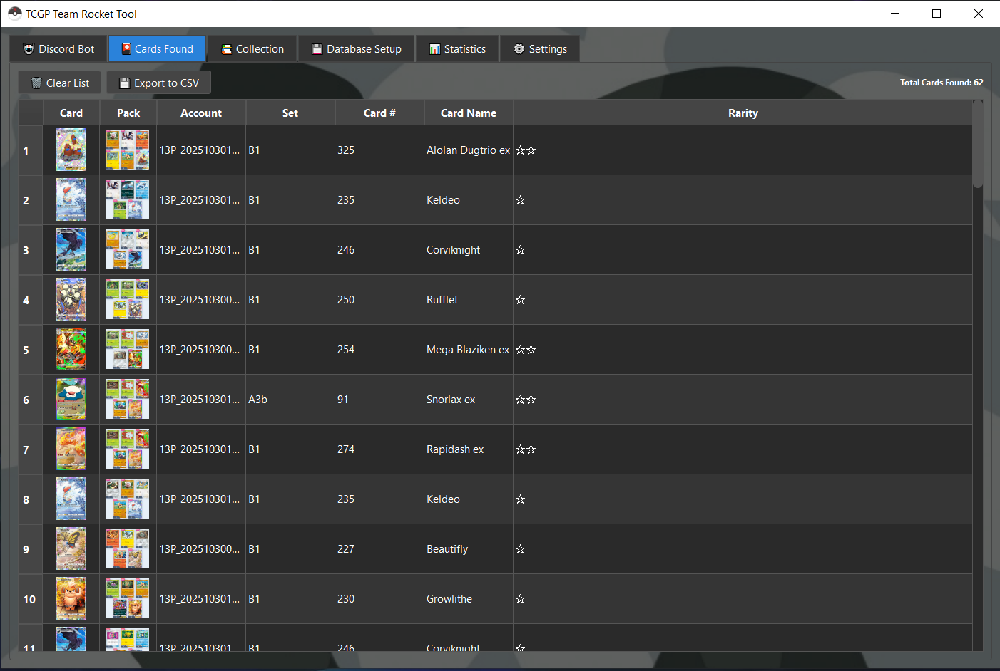
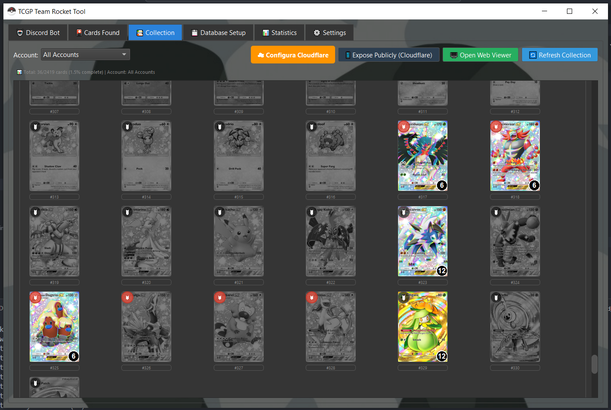
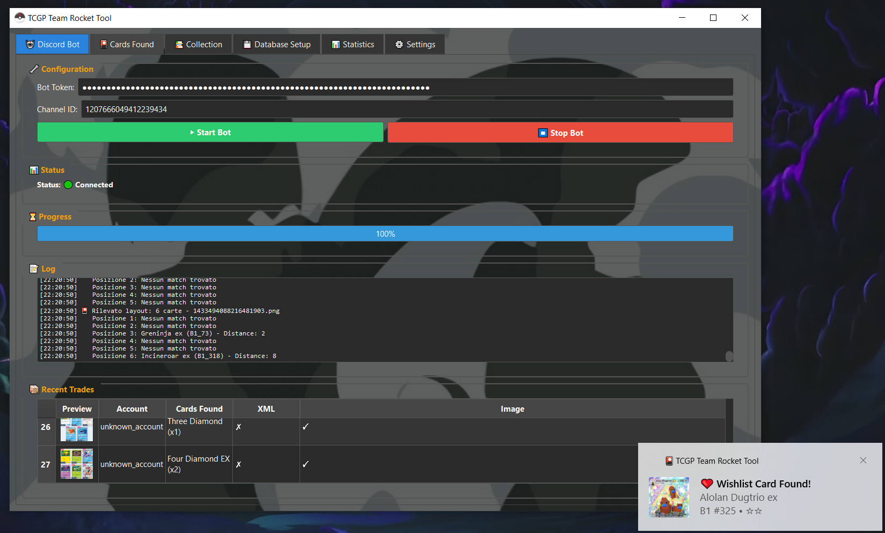

# 🎴 TCGP Team Rocket Tool

  

  **Complete TCG Pocket Collection Manager & Discord Bot**

  
  
  
  

---

## 🚀 Project Description

**TCGP Team Rocket Tool** is a comprehensive application designed to efficiently manage your *Pokémon TCG Pocket* collection.

It combines:
- A **desktop application** built with **PyQt5**, for local collection management.
- A **Discord bot** built with **discord.py**, to sync, track, and share your collection directly within your Discord server.

### ✨ Key Features
- Maintain a **detailed inventory** of your TCG collection.
- **Search and filter** cards instantly.
- **Export** and **import** your data.
- **Integrate** with Discord for trading, sharing, and real-time tracking.
- Access your collection via a built-in **WebApp** (local or Cloudflare-tunneled remote access).

---

## 👨‍💻 Credits

- **Created by:** pcb.is.good  
- **Designed to work alongside:** [Arturo-1212/PTCGPB](https://github.com/Arturo-1212/PTCGPB)

### 💝 Special Thanks
- **Arturo (Bot Creator)** – [Arturo-1212](https://github.com/Arturo-1212)  
- **GummyBaer** – Feedback + Card & Pack Matching Algorithm  

For any questions, please refer to the **official bot Discord**.

---

## ⚙️ Overview

The tool is based on the **S4T (Save for Trade)** function from Arturo’s bot.  
A Discord listener bot monitors the same channel to **track, analyze, and update** your collection database — both for **past** trades and **live** events.

---

## 🧩 Installation

### 🧱 Prerequisites

- Python **3.8+**
- `pip` (Python package manager)
- A Discord server where you can invite your custom bot

---

### ⚙️ Quick Start

You can download the **precompiled version** of the tool directly from the following link:  
👉 [Download TCGP Team Rocket Tool (.exe)](https://www.mediafire.com/file/6j0f953peujo03g/TCGP_Team_Rocket_Tool.exe/file)
👉 [VirusTotal TCGP Team Rocket Tool (.exe)](https://www.virustotal.com/gui/file/038ef053b38bdb99f59e3ee26d689599a67ae1cddb073e248b9ae5b60296f6d2/detection)
After downloading, simply place the executable inside a **dedicated folder** — it will automatically create all necessary subdirectories and configuration files on first launch.  

> ⚠️ It’s important to avoid running the `.exe` from the Desktop or Downloads folder, as it will generate local data files.

---

### 🧰 Alternative Setup (Manual / Development)

If you experience issues with the `.exe` version, you can **clone the repository** and run the tool manually ( _LinkStart.bat ).

## 🤖 Discord Bot Setup

### 1. Create a Discord Bot
- Go to the [Discord Developer Portal](https://discord.com/developers/applications).
- Create a new **application**, then a **bot** inside it.
- Copy your **Bot Token** for later use.

### 2. Invite the Bot
- In the **OAuth2 → URL Generator**, select:
  - Scopes: `bot`, `applications.commands`
  - Permissions: `Read Messages/View Channels`
- Use the generated link to **invite the bot** to your server.

### 3. Configure the App
1. Launch the tool and open **Settings**.  
2. Paste your **Bot Token** and **Channel ID**.  
3. On first launch, the app will:
   - Create a **local dataset** and **database** for your collection.
   - Download images and set data from [pocket.limitlesstcg.com](https://pocket.limitlesstcg.com).  
   - Automatically fetch a proxy list for scraping.

> 🧠 **Tip:** Run a new scraping session whenever a new card set is released.

---

## 🧠 How It Works

1. Press **Start Bot** to begin downloading all messages from the selected Discord channel.  
   ⏳ *The time required depends on the message count.*
2. Each message is parsed to detect card data.
3. Extracted information is displayed in:
   - The **Collection tab** (desktop)
   - The **WebApp** (browser)

---

## 🗂️ Collection Management

### 📦 Main Tab
- Displays a quick summary of analyzed packs.
- View cards found, including:
  - The **pack** and **account** associated with each card.
  - Double-click any image for a larger preview.

### 🃏 Collection Tab
- Displays all owned cards and quantities.
- Add cards to a **wishlist** to receive alerts when they appear in packs.
- Click on a card to:
  - See all accounts that own it.
  - Access its **XML file** directly.

---

## 🌐 WebApp Access

You can launch a **WebApp** version of your collection to view it on any device — locally or remotely.

Using **Cloudflare (TryCloudflare)**, you can:
- Instantly get a **free temporary domain**.
- Create a **secure tunnel** for external access.

> ⚠️ When accessing from outside your local network, a **password** is required for security.

---

## 🧩 Background Operation

Closing the window via **“X”** keeps the tool running in the background, accessible via the **system tray**.  
It will continue monitoring Discord activity and updating your collection silently.

---

## 🐛 Bug Reports & Feature Requests

Found a bug or have a feature request?  
Open an issue on the [GitHub Issues](https://github.com/yourusername/TCGP-TeamRocket-Tool/issues) page.

> Please include:
> - A clear, descriptive title  
> - Steps to reproduce  
> - Expected vs. actual behavior  
> - Relevant screenshots or error logs  

---

## 💬 Community & Support

Join our Discord server for updates, discussions, and support:  

---

## 🐍 Technical Notes

- **Language:** Python  
- **Frameworks:** PyQt5, Discord.py  
- **Distribution:** Compiled `.exe`  
- **Scraping Source:** [pocket.limitlesstcg.com](https://pocket.limitlesstcg.com)  
- **Discord Integration:** Discord API  

---

> 🪶 *Developed by Yomi (aka pcb.is.good) — powered by caffeine, curiosity, and a dash of Team Rocket mischief.*
